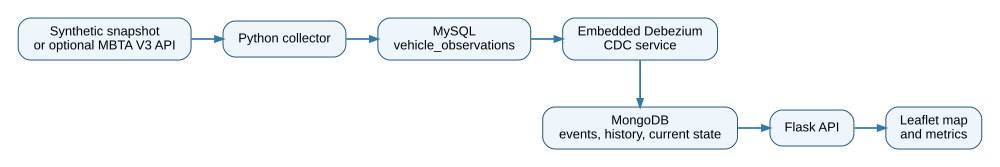

# Real-Time Transit Data Pipeline

An independently authored portfolio implementation of a multi-service transit event pipeline. The project collects vehicle observations, stores them in MySQL, captures row-level changes with an embedded Debezium engine, writes traceable records to MongoDB, and serves current vehicle state through a Flask API and interactive map.

> **Release status:** Owner-approved public portfolio release. The reviewed v3 application passed an untouched empty-volume Docker Desktop start on September 5, 2026, with zero CDC restarts. This edition records that validation and Ben Pierce's explicit publication approval through documentation-only updates. Tested application code, dependencies, Docker configuration, tests, and synthetic data remain unchanged. Do not publish local `.env` files, private runtime evidence, or historical captured records.

## Validated local demonstration

| Check | Recorded result |
|---|---|
| Fresh start | Empty project volumes; no manual service restart |
| CDC health | Restart count 0; failed-event count 0 |
| Synchronized storage | 84 MySQL rows, 84 MongoDB observations, 84 CDC events |
| Current state | Seven `demo-vehicle-*` vehicles |
| Python tests | 45 passed, 0 skipped, before and after local configuration |
| Java tests | 7 passed, 0 failures, 0 errors, 0 skipped |
| Browser | Readable timestamps, contained tiles, visible attribution |

These are recorded results from the supplied September 5 validation evidence, reviewed before owner approval. Counts are capture-specific, not throughput or scale benchmarks. Validation covers the default synthetic mode on Docker Desktop, not optional live/replay modes or an internet-facing production deployment. See [Validation](docs/VALIDATION.md) and [Release review](docs/RELEASE_REVIEW.md).

## What this project demonstrates

- Python data collection from deterministic synthetic data or an optional public transit API
- MySQL relational storage and row-level binary logging
- Embedded Debezium change data capture
- MongoDB event, observation, and current-state collections
- Flask JSON endpoints and an interactive Leaflet map
- Docker Compose orchestration for five services
- TCP-aware MySQL readiness and failure-aware CDC service health
- Empty-volume integration validation with no manual CDC restart
- Automated tests, secret scanning, source validation, and structured error handling
- Reproducible synthetic replay data and analysis
- Environment-based credential handling

## Architecture

```text
Synthetic snapshot or optional MBTA V3 API
                    |
              Python collector
                    |
                    v
       MySQL vehicle_observations
                    |
            row-level binlog events
                    |
                    v
        Embedded Debezium CDC service
                    |
                    v
 MongoDB cdc_events, vehicle_observations,
             and latest_vehicles
                    |
                    v
          Flask API and web map
```



## Historical analysis context

An earlier private educational prototype used a preserved **6,767-observation data slice** spanning **36 trips**, **13 vehicles**, and approximately 4.85 hours. That data slice was **not the full runtime** of the earlier system.

The original analysis reported 43.14 minutes and 7.28 km/h because it included three incomplete trips. A later audit restricted the calculation to the **20 trips that reached stop sequence 24**. The corrected primary historical findings are:

- **45.40-minute average completion time**
- **7.56 km/h average point-to-point speed**

The captured historical records and private educational materials are not included in this repository. The **public synthetic dataset is separate** and is intended only for deterministic demonstration and testing. Its results do not reproduce or replace the historical findings.

## Quick start

### 1. Check the untouched public files

Run the distributable-file checks before creating a local `.env` file:

```bash
python -m pip install -r requirements-dev.txt -r collector/requirements.txt -r web/requirements.txt
python scripts/generate_synthetic_data.py --check
python scripts/secret_scan.py --public-files
python scripts/validate_project.py
pytest -q
```

### 2. Create local configuration

```bash
cp .env.example .env
```

Replace every `change-me-...` value in `.env`. Never commit `.env`.

### 3. Run the empty-volume release gate

This command deletes this project's Docker volumes, builds without cache, starts all five services, requires a CDC event, and fails if the CDC container restarts:

```bash
python scripts/validate_fresh_start.py --confirm-reset --keep-running
```

No manual service restart is permitted during this validation.

### 4. Open the application

- Web interface: `http://localhost:3000`
- Web health: `http://localhost:3000/health`
- CDC health: `http://localhost:8080/health`

### 5. Stop

```bash
docker compose --env-file .env down -v
```

See `docs/RUN_FULL_STACK.md` for complete commands, database checks, and evidence capture.

## Normal development start

After the release gate has passed, a normal local start can use:

```bash
docker compose --env-file .env up -d --build
python scripts/validate_running_stack.py
```

## Data modes

### Synthetic mode, default

Synthetic mode repeatedly inserts seven deterministic API-shaped vehicle observations. No captured vehicle identifiers are committed.

```dotenv
COLLECTOR_MODE=synthetic
```

### Replay mode

Replay mode processes a deterministic synthetic CSV containing six complete trips and two incomplete trips.

```dotenv
COLLECTOR_MODE=replay
```

### Live mode, optional

Live mode reads the public MBTA V3 API endpoint configured by `TRANSIT_API_URL`.

```dotenv
COLLECTOR_MODE=live
```

Live-mode transit data is provided by the Massachusetts Department of Transportation, including the MBTA V3 API. This independent project is not affiliated with, endorsed by, or certified by MassDOT or the MBTA. See `docs/ATTRIBUTION.md`.

## Public synthetic analysis

Generate and analyze the public synthetic dataset:

```bash
python scripts/generate_synthetic_data.py --check
python analysis/synthetic_trip_analysis.py
```

The public dataset contains 186 synthetic observations and deliberately includes incomplete trips so the analysis can demonstrate transparent completeness rules. Its current generated summary is separate from the historical private-prototype analysis described above.

## Local checks

After `.env` exists, use the public-files scan so disposable local passwords are not mistaken for committed credentials:

```bash
python scripts/generate_synthetic_data.py --check
python scripts/secret_scan.py --public-files
python scripts/validate_project.py
pytest -q
```

To intentionally scan the local `.env` too, run:

```bash
python scripts/secret_scan.py
```

Java tests run during the CDC service Docker build. With Maven installed:

```bash
cd cdc-service
mvn -B -ntp test
```

## Repository layout

```text
collector/       Python collection service and MySQL writer
cdc-service/     Java 21 embedded Debezium service and MongoDB sink
mysql/           MySQL schema and CDC user initialization
web/             Flask API and Leaflet/OpenStreetMap interface
analysis/        Reproducible analysis of synthetic replay data
data/            Deterministic synthetic fixtures and replay data
docs/            Architecture, provenance, attribution, validation, and release guidance
scripts/         Data generation, validation, secret scanning, and export helpers
tests/           Cross-project Python tests
```

## Attribution

- Transit data in live mode: Massachusetts Department of Transportation, including the MBTA V3 API
- Map data and tiles: © OpenStreetMap contributors
- Interactive map library: Leaflet, BSD 2-Clause License

See `NOTICE.md`, `THIRD_PARTY_NOTICES.md`, and `docs/ATTRIBUTION.md`.

## Provenance

This public edition contains independently authored source and documentation. It excludes private instructional materials, evaluation evidence, historical credential-bearing files, captured vehicle data, and private runtime logs. See `docs/PROVENANCE.md`.

## License

Copyright © 2026 Ben Pierce. All rights reserved. Third-party software and data remain subject to their own terms and licenses.
